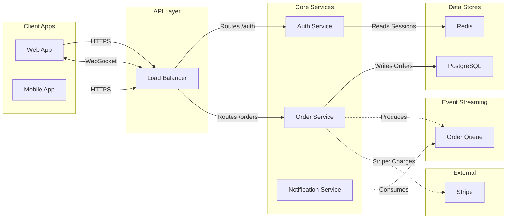
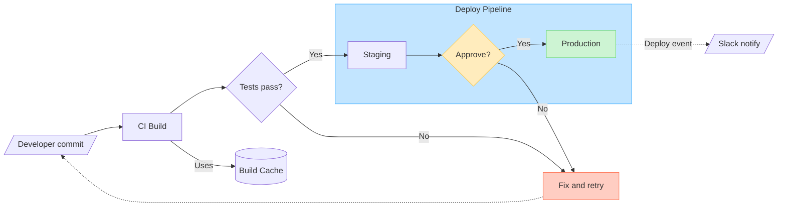
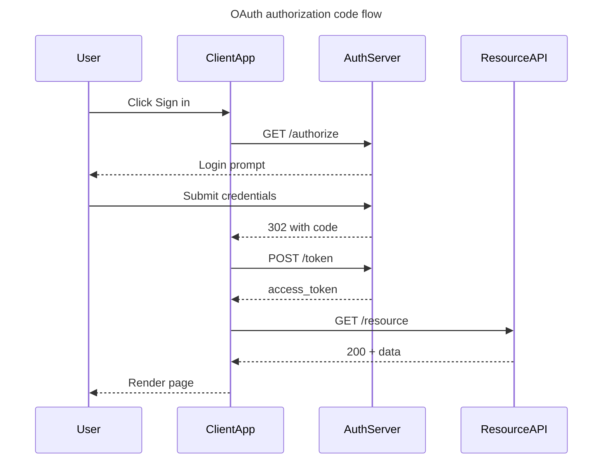
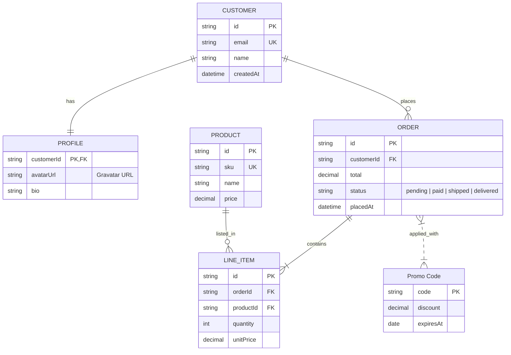
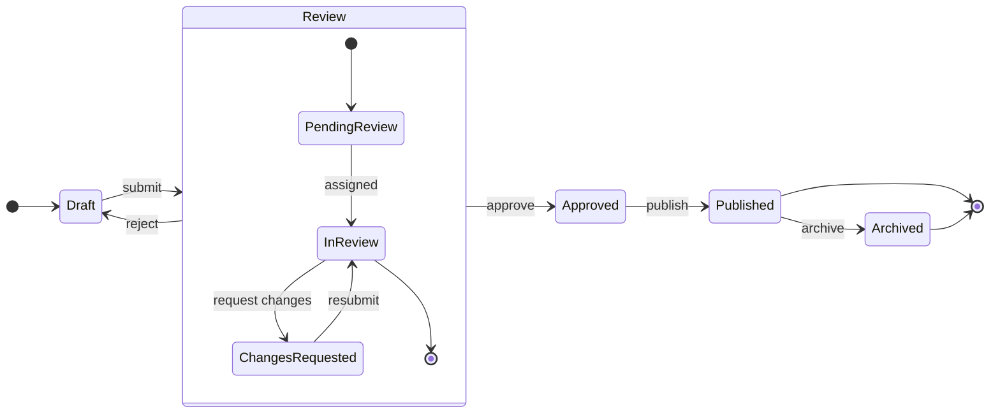
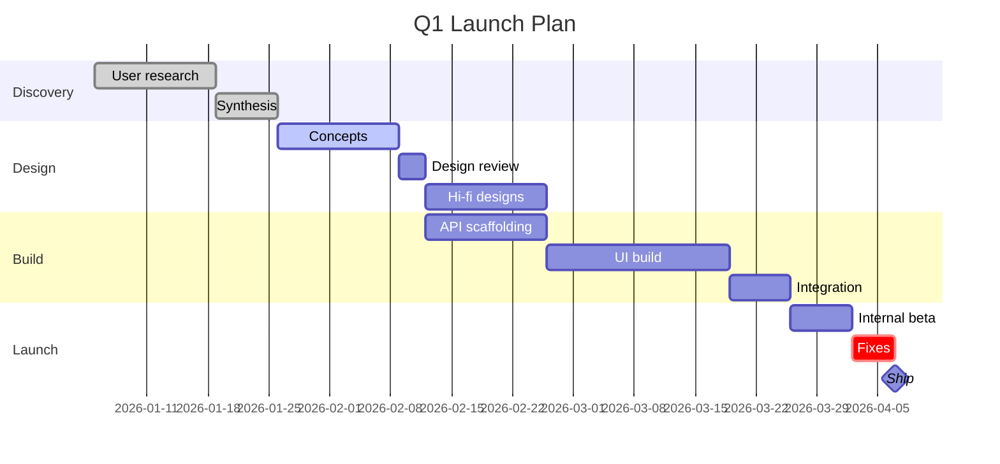

# generate-diagram

**You MUST load this skill before every `generate_diagram` tool call.** Skipping it causes preventable rendering failures and low-quality output.

`generate_diagram` takes Mermaid.js syntax and produces an editable FigJam diagram. This skill routes you to the right per-type guidance and sets universal constraints.

## Step 1: Is `generate_diagram` the right tool?

### Supported diagram types

`flowchart`, `sequenceDiagram`, `stateDiagram` / `stateDiagram-v2`, `gantt`, `erDiagram`.

### Unsupported — don't call the tool

If the user wants any of these, tell them directly that `generate_diagram` doesn't support it instead of calling the tool and failing:
- **Pie chart, mindmap, venn diagram, class diagram, journey, timeline, quadrant, C4, git graph, requirement diagram**

### When to push the user to edit in Figma

The tool cannot:
- Change fonts on an existing diagram
- Move individual shapes
- Edit a diagram node-by-node after generation

If the user asks for any of those on an existing diagram, recommend they open the diagram in Figma and edit there. For content-level changes, it's usually faster to regenerate.

## Step 2: Pick the diagram type

Lightweight routing — use the first match.

| User wants… | Type | Next step |
|---|---|---|
| Services + datastores + queues + integrations | **Architecture flowchart** | Read [Architecture Diagrams](#reference--architecture-diagrams) |
| Decision tree, process flow, pipeline, dependency graph, user journey | **Flowchart** | Read [Flowcharts (non-architecture)](#reference--flowcharts-non-architecture) |
| Interactions between parties over time (API calls, auth, messaging) | **Sequence diagram** | Read [Sequence Diagrams](#reference--sequence-diagrams) |
| Data model, tables, keys, cardinality | **ER diagram** | Read [Entity-Relationship Diagrams](#reference--entity-relationship-diagrams) |
| Named states with transitions between them | **State diagram** | Read [State Diagrams](#reference--state-diagrams) |
| Project schedule with dates, milestones | **Gantt chart** | Read [Gantt Charts](#reference--gantt-charts) |

If a flowchart is requested and it describes software infrastructure (services, datastores, queues, external integrations), route to `architecture.md` — not `flowchart.md`. When in doubt, ask the user.

## Step 3: Universal constraints (apply to every diagram type)

1. **No emojis** in any part of the Mermaid source. The tool rejects them.
2. **No `\n`** in labels. Use newlines only when absolutely required and only via actual line breaks (not the escape sequence).
3. **No HTML tags** in labels.
4. **Reserved words** — don't use `end`, `subgraph`, `graph` as node IDs.
5. **Node IDs**: camelCase (`userService`), no spaces. Underscores can break edge routing in some processors.
6. **Special characters in labels** must be wrapped in quotes: `A["Process (main)"]`, `-->|"O(1) lookup"|`.
7. **Sequence diagrams** — Mermaid `Note over X` / `Note left of X` / `Note right of X` are silently stripped by the renderer; don't put them in the source. If the user wants annotations on a sequence diagram, generate the base diagram first and add stickies/text via the hybrid workflow ([Hybrid Diagram Workflow](#reference--hybrid-diagram-workflow)).
8. **Gantt charts** — `classDef`, `class`, and any other styling are stripped by preprocessing; the rendered chart will not have colors. If the user wants color-coded phases, milestones, or tasks, generate the base chart first and add color/annotations via the hybrid workflow ([Hybrid Diagram Workflow](#reference--hybrid-diagram-workflow)) — or, for diagrams that fundamentally need styling, build the timeline directly with `use_figma` instead (see [Gantt Charts](#reference--gantt-charts) §11).
9. **Use FigJam-only APIs in any `use_figma` extension.** `generate_diagram` output lands in a FigJam file (`figma.com/board/...`), so hybrid extensions must stick to FigJam-supported APIs. Do NOT call `figma.createPage()` — it's Design-only (`figma.com/design/...`) and throws `TypeError: figma.createPage no such property 'createPage' on the figma global object` in FigJam. Organize content with FigJam sections instead (see figma-use-figjam (load `readPowerSteering("figma", "figma-use-figjam.md")`)).

## Step 4: Garbage in, garbage out

The quality of the generated diagram is bounded by the quality of the Mermaid you produce, which is bounded by the context you have. Before writing Mermaid, make sure you have enough real information to describe the subject accurately — and use whatever the current environment gives you to gather it.

Depending on what's available, useful sources of context include:

- **Source code** — grep/read the relevant files so the diagram reflects real service names, real edge labels, real data stores, real entry points. Walking actual routes/handlers/consumers beats recreating from memory.
- **User-provided documents** — a PRD, spec, meeting notes, transcript, research synthesis, onboarding doc, process write-up. Ask the user to paste or attach it if the subject isn't code.
- **Existing Figma or FigJam files** — if the new diagram should align with one the user already has, read it with `get_figjam` or `get_design_context` (see the `figma-use` and `figma-use-figjam` skills).
- **Other MCP servers or tools you have available** — issue trackers, docs sites, CRMs, analytics, internal wikis, design systems, database schemas, etc. If a connected tool holds the ground truth for what you're diagramming, pull from it rather than guessing.
- **The user themselves** — when the description is thin or ambiguous (unclear direction of flow, unclear scope, unclear which entities matter), ask one or two focused questions before generating. Examples: "What are the 3–5 main steps?", "Who owns each step?", "What triggers the next step?". One good question beats one wasted diagram.

Don't invent edges, labels, or entities to "round out" a diagram. Missing information is better than hallucinated information — leave a gap and flag it to the user.

## Step 5: Will the diagram need more than Mermaid can express?

Mermaid can't do everything. Sticky-note annotations tied to specific nodes, per-node domain coloring on ERDs, callouts with attached data — these all require composing `generate_diagram` with `use_figma` (via the figma-use-figjam (load `readPowerSteering("figma", "figma-use-figjam.md")`) skill). This is the **hybrid workflow**.

It's a judgment call, not a default. Deploy it when the user's ask clearly benefits — skip it when the base diagram is obviously enough. Signals that say yes: user explicitly asked for notes, colors, callouts, or "X attached to each node"; they shared data that maps to specific nodes; the diagram is a shareable artifact, not a thinking sketch. Signals that say no: short/self-explanatory request, small diagram, user exploring or testing.

**If hybrid is warranted, read [Hybrid Diagram Workflow](#reference--hybrid-diagram-workflow) before calling `generate_diagram`** — it covers the pattern, two core recipes (annotations + color-coding), communication style, and failure handling. If not, proceed directly to Step 6.

## Step 6: Calling the tool

Required:
- `name`: a descriptive title (shown to the user)
- `mermaidSyntax`: the Mermaid source

Optional:
- `userIntent`: a short sentence describing what the user is trying to accomplish — helps telemetry and downstream tuning
- `useArchitectureLayoutCode`: **only for architecture diagrams**; value is specified in [*Architecture Diagrams*](#reference--architecture-diagrams)
- `fileKey`: if the user wants the diagram added to an existing FigJam file instead of a new one

Do **not** call `create_new_file` before `generate_diagram` — the tool creates its own file.

## Step 7: After generation

- The tool returns a link (or widget) the user can click to open the diagram in FigJam. Show it as a markdown link unless the client renders an inline widget.
- If extensions are warranted (see Step 5), compose with `use_figma` now — the pattern and recipes are in [Hybrid Diagram Workflow](#reference--hybrid-diagram-workflow).
- If the user is dissatisfied after 2 attempts at the same diagram, stop regenerating. Ask what specifically is wrong, or suggest they open it in Figma and edit manually rather than burning more tool calls.

### Reuse the same file when iterating or adding related diagrams

Every call to `generate_diagram` without a `fileKey` creates a new FigJam file in the user's drafts. Regenerating 4 times = 4 draft files to clean up. Prefer reusing the existing file when:

- The user is iterating on the same diagram ("try again with…", "change the labels…").
- The user wants a follow-up diagram that lives alongside the first (e.g. a sequence diagram next to a flowchart of the same system).

How to reuse:

1. **Pass `fileKey`** on subsequent `generate_diagram` calls. Extract from a `figma.com/board/{fileKey}/...` URL. The diagram is added to the existing file rather than creating a new one.
2. If you want to replace the previous diagram rather than adding next to it, use the `use_figma` tool (see the `figma-use-figjam` skill) to delete the old diagram's nodes first, then call `generate_diagram` with the same `fileKey`. Or leave the old diagram and place the new one beside it — readers often benefit from seeing the history of attempts.

Ask the user which they prefer the first time you iterate — "regenerate over the old one, or keep both side-by-side?" — and remember their answer for subsequent iterations in the session.

---

## Reference — Architecture Diagrams

Use this reference when the user asks for a **software architecture diagram** — a view showing services, datastores, message queues, external integrations, and how they connect. These are flowcharts rendered by a bespoke grid-based layout (not ELK), controlled by the `useArchitectureLayoutCode` parameter on `generate_diagram`.

For generic flowcharts (decision trees, process flows, dependency graphs), use [Flowcharts (non-architecture)](#reference--flowcharts-non-architecture) instead.

### Contents

1. [Before you start](#before-you-start)
2. [Rules](#rules)
   - [Hard rules (MUST)](#hard-rules-must)
   - [Correctness rules](#correctness-rules)
   - [Allowed edges](#allowed-edges)
   - [Known gotchas](#known-gotchas)
3. [Subgraph categories](#subgraph-categories)
   - [Common ambiguities](#common-ambiguities)
4. [Async subgraph](#async-subgraph)
5. [Node granularity](#node-granularity)
6. [Edge types](#edge-types)
7. [Validation checklist](#validation-checklist)
8. [Mermaid syntax rules](#mermaid-syntax-rules)
9. [Complete example](#complete-example)
10. [Calling generate_diagram](#calling-generate_diagram)

---

### Before you start

**Don't hallucinate labels or edges.** If the user describes their architecture in vague terms ("we have a few microservices"), ask one or two focused questions before generating instead of inventing services or connections that don't exist. A diagram of a real, partial system is more useful than a polished diagram of an imagined one.

When the source of truth is code or docs (a repo, a runbook, a Datadog dashboard), read it before drawing. Walking real routes, handlers, and consumers beats recreating from memory.

---

### Rules

**Read these before writing Mermaid.** After writing, re-check the [Validation checklist](#validation-checklist) before calling the tool — that section is the post-write pass and it's tighter than this list.

This section uses **two severity tiers**. Both are real rules — the difference is what happens if you violate them.

- **MUST / MUST NOT** — the tool errors, the renderer crashes, or the diagram silently comes out wrong in a way the agent can't detect.
- **Never / Always** — the diagram renders, but it's structurally wrong or misleading.

#### Hard rules (MUST)

1. **`flowchart LR` only.** The bespoke layout is designed for left-to-right; `TD` / `TB` are not supported.
2. **Every node MUST be inside a subgraph.** Nodes outside a subgraph have no layer assignment and the layout cannot place them. Colors and shapes are auto-assigned from subgraph membership — you don't need `classDef`, `class`, or `style` statements.
3. **Subgraph IDs MUST be exactly one of:** `client`, `gateway`, `service`, `datastore`, `external`, `async`. The layout uses these IDs to position lanes; unknown IDs break placement. Use display labels for human-readable titles: `subgraph service ["Core Services"]`.
   - **WRONG:** `subgraph Services`
   - **RIGHT:** `subgraph service ["Core Services"]`
4. **Forward and bidirectional edges MUST form a DAG** across `client -> gateway -> service -> datastore`. Cycles among these will cause the tool to error. Any backward-flowing relationship must use a backward edge (rule 8) instead.
5. **All edges touching an async or external node MUST use dotted syntax (`-.->`)**, in either direction. The renderer uses the dotted style as a signal to route async/external paths differently from the core flow.

#### Correctness rules

These won't crash the renderer, but they produce structurally wrong or misleading diagrams.

6. **One node = one independently deployable unit.** Don't decompose a service into internal modules. See [Node granularity](#node-granularity) for the test.
7. **Bidirectional edges write source -> target in the forward direction.** `client <-->|"WS"| gateway`, not `gateway <-->|"WS"| client`. The layout uses the source position to anchor the edge.
8. **Backward edges use `<---` and write the left node first.** The arrow points left. Example: `orderService <---|"Refund"| paymentService` — the refund flows from `paymentService` back to `orderService`.
9. **Never connect edges to subgraph IDs.** Subgraphs are containers, not anchorable nodes; the layout cannot route an edge from a subgraph ID. Connect to a specific node inside the subgraph instead.
10. **Never create two edges between the same pair of nodes.** The renderer may overlap or drop duplicates. Combine into one edge with a merged label.
11. **Bidirectional intent = one `<-->` edge.** Don't split into separate `-->` and `-.->`.

#### Allowed edges

The diagram is valid only if every edge fits one of the source -> target pairs in this table. Anything not in the table is wrong by construction — a `service` must mediate.

| From          | To                       | Edge syntax | Use for                                                                |
| ------------- | ------------------------ | ----------- | ---------------------------------------------------------------------- |
| `client`      | `gateway`                | `-->`       | HTTPS, GraphQL                                                         |
| `client`      | `gateway`                | `<-->`      | WebSocket, real-time bidirectional                                     |
| `gateway`     | `service`                | `-->`       | Routes, proxying                                                       |
| `service`     | `service`                | `-->`       | Internal RPC, microservice calls                                       |
| `service`     | `service`                | `<-->`      | gRPC streaming, bidirectional internal channel                         |
| `service`     | `service`                | `<---`      | Backward edge: callbacks, invalidations, refunds (left node first)     |
| `service`     | `datastore`              | `-->`       | Read, write, query                                                     |
| `service`     | `async`                  | `-.->`      | Produce events                                                         |
| `async`       | `service`                | `-.->`      | Consume, fan out                                                       |
| `service`     | `external`               | `-.->`      | Third-party API call — label as `"ServiceName: Purpose"`               |

**Common mistakes** (none of these appear in the table above; if you find yourself drawing one, restructure):

- `client` -> anything except `gateway` (`gateway` must mediate)
- `gateway` -> `datastore`, `async`, or `external` (a `service` must mediate)
- Direct edges between two `datastore` nodes, two `async` nodes, or a `datastore` and an `async` node (in any direction — a `service` must mediate)
- `external` -> anything except `service`, or any direct edge between two `external` nodes
- Any edge to or from a subgraph ID instead of an individual node (see correctness rule 9)

Two worked anti-patterns:

```
WRONG: kafka -.-> sqs
RIGHT: worker -.->|"Consumes"| kafka  then  worker -.->|"Produces"| sqs

WRONG: alb -.-> stripe
RIGHT: alb --> orders  then  orders -.->|"Stripe: Charges"| stripe
```

#### Known gotchas

- **Bidirectional async (`<-.->`) is not supported** — it silently falls back to a forward edge `-.->`. If you need bidirectional async, model it as two separate `-.->` edges with different labels (e.g., `service -.->|"Produces"| queue` and `queue -.->|"Consume"| service`).

### Subgraph categories

Layout order: `client` -> `gateway` -> `service` -> `datastore`, with `external` placed on the right alongside the `datastore` lane. `async` sits above or below the service+datastore lanes. Colors and shapes are auto-assigned — use plain `[text]` syntax for all nodes.

| Subgraph ID | What Belongs Here |
|---|---|
| `client` | Web/mobile/desktop apps, CLI, end users |
| `gateway` | CDN, load balancer, API gateway, reverse proxy |
| `service` | Microservices, monoliths, serverless, ETL, async workers, cron jobs |
| `datastore` | Databases, caches, object storage (PostgreSQL, Redis, S3, Elasticsearch) |
| `external` | Feature flags, monitoring, payment, OAuth, third-party SaaS |
| `async` | Message infrastructure: Kafka, RabbitMQ, SQS, Pub/Sub, EventBridge, Redis Streams |

#### Common ambiguities

When a node could plausibly fit two categories, use these defaults. When still in doubt, ask the user.

- **CloudFront, Cloudflare, Akamai, other CDNs** -> `gateway` if the diagram discusses your routing config (it's part of your network); `external` if it's just "we use Akamai" with no per-route detail.
- **AWS Lambda / serverless functions** -> `service`. Treat one Lambda as one node if independently deployed; otherwise group as one logical service.
- **Stripe webhook delivery** -> `external` for Stripe itself; the queue you receive webhooks into goes in `async`.
- **Datadog, Sentry, third-party monitoring** -> `external`. They receive data but aren't part of your request flow.
- **Read replicas, sharded DBs** -> one `datastore` node unless they're addressed independently in the flow being diagrammed.
- **Consumer workers** -> `service`, never `async` (queues are infrastructure; the worker that consumes them is a service).
- **DB replication features (WAL, CDC)** -> omit, or use a dotted edge label from the `datastore` node. They aren't independently deployable, so they're not their own node.

### Async subgraph

**Async nodes = independently deployable message infrastructure.**

Does NOT belong in `async`:
- Consumer workers -> `service`
- DB replication features (WAL, CDC) -> omit or use a dotted edge label from `datastore`
- Logical splits of a single broker -> use one node

Canonical pattern: `service -.->|"Produce"| queue` and `queue -.->|"Consume"| service`

### Node granularity

"Can I deploy, restart, or scale this independently?" Yes = node. No = omit.

### Edge types

| Category | Syntax | Use For |
|----------|--------|---------|
| **Forward** | `-->` | Normal left-to-right data flow |
| **Bidirectional** | `<-->` | WebSocket, gRPC streaming (write in forward direction) |
| **Backward** | `<---` | Return flows, invalidation (left node first) |
| **Async/External** | `-.->` | Any edge touching async or external nodes |

#### Edge decision

For each edge, identify the source and target subgraphs, look up the row in [Allowed edges](#allowed-edges), and use that row's syntax. If no row matches, the edge isn't allowed — restructure (usually by inserting a `service` to mediate).

> **External edges** render to the section boundary. Include the service name in the label: `"ServiceName: Purpose"`.

#### Best practices

These are style preferences — they make the diagram easier to read but won't cause structural problems if violated.

1. **One flow per diagram.** Focus on the architecture the user asked about.
2. **Max 15-20 edges.** Omit edges unrelated to the requested flow.
3. **Label every cross-subgraph edge.** Use a verb from the source node's perspective, with specifics when relevant (e.g., "Reads Users", "Writes Orders", "Produces"). 1-4 words max.

### Validation checklist

**This is the post-write pass.** Walk every item below after generating Mermaid and before calling `generate_diagram` — these catch the rule violations that are easiest to introduce while writing.

1. **Forward and bidirectional edges form a DAG.** Any edge that would form a cycle is represented as a backward edge (`<---`) instead.
2. **Every service has both input and output.** For each service node, ask: "Where does it get data from?" and "Where does it return data to?" If either answer is missing, the edge is missing or the node shouldn't be there.
3. **Walk each service node one by one.** List every service node, then for each one confirm it has at least one incoming edge and one outgoing edge. Fix gaps before calling the tool.

### Mermaid syntax rules

1. Node IDs: camelCase, no spaces or underscores (`userService`, not `user service` or `user_service`). The layout splits on `_` internally, so underscores in IDs will break edge routing.
2. Labels with special chars: wrap in double quotes (`A["Process (main)"]`).
3. Edge labels with special chars: wrap in quotes (`-->|"O(1) lookup"|`).
4. Avoid reserved words as node IDs: `end`, `subgraph`, `graph`.
5. No HTML tags or emojis in labels.

### Complete example



### Calling generate_diagram

When calling `generate_diagram` for an architecture diagram, pass:

- `name`: A descriptive diagram name
- `mermaidSyntax`: Your Mermaid syntax following all rules above
- `useArchitectureLayoutCode`: `"FIGMA_DIAGRAM_2026"`
- `userIntent` (optional): What the user is trying to accomplish

---

## Reference — Flowcharts (non-architecture)

Use this reference for **generic flowcharts** — decision trees, process flows, pipelines, dependency graphs, user journeys, anything that is not a software architecture diagram (those go to [Architecture Diagrams](#reference--architecture-diagrams)).

These diagrams render via ELK (Eclipse Layout Kernel) with an orthogonal, layered layout. The rules below are tuned to produce diagrams that read well, use FigJam's shape vocabulary, and avoid the layout traps ELK struggles with.

### Contents

1. [Direction: pick once, up front](#1-direction-pick-once-up-front)
2. [Shapes: use the vocabulary, don't over-decorate](#2-shapes-use-the-vocabulary-dont-over-decorate)
3. [Edges: strokes, end caps, labels](#3-edges-strokes-end-caps-labels)
4. [Subgraphs: group related nodes](#4-subgraphs-group-related-nodes)
5. [ELK survival guide](#5-elk-survival-guide)
6. [Colors: use sparingly, semantically](#6-colors-use-sparingly-semantically)
7. [Text quality](#7-text-quality)
8. [Density and when to split](#8-density-and-when-to-split)
9. [Validation checklist (before calling the tool)](#9-validation-checklist-before-calling-the-tool)
10. [Complete example](#10-complete-example)
11. [When a flowchart is NOT the right choice](#11-when-a-flowchart-is-not-the-right-choice)
12. [Calling generate_diagram](#12-calling-generate_diagram)

---

### 1. Direction: pick once, up front

- `flowchart LR` — **default**. Best for sequential processes, pipelines, dependency chains, most 2–3 level decision trees.
- `flowchart TD` (or `TB`) — switch when you have hierarchies, taxonomies, deep narrow trees, or many sibling nodes at the same level (keeps width manageable).

Never change direction mid-diagram. Pick before writing.

### 2. Shapes: use the vocabulary, don't over-decorate

Mermaid exposes dozens of shape names; most silently fall back to a plain rectangle in FigJam. The table below lists **only the shapes that render as a distinct FigJam shape** — prefer these when they carry meaning.

| Mermaid short form | `@{shape: ...}` form      | Renders as                  | Use for                          |
| ------------------ | ------------------------- | --------------------------- | -------------------------------- |
| `A[Text]`          | `shape: rect` / `square`  | Rectangle                   | Generic process / step (default) |
| `A(Text)`          | `shape: rounded`          | Rounded rectangle           | Softer step, grouped process     |
| `A([Text])`        | `shape: stadium`          | Rounded rectangle (stadium) | Start / end of a flow            |
| `A((Text))`        | `shape: circle`           | Ellipse                     | Entry/exit points, events        |
| `A{Text}`          | `shape: diamond`          | Diamond                     | **Decisions** (yes/no, branch)   |
| `A{{Text}}`        | `shape: hexagon` / `hex`  | Hexagon                     | Preparation, setup, handoff      |
| `A[[Text]]`        | `shape: subroutine`       | Predefined process          | Called function / sub-procedure  |
| `A[(Text)]`        | `shape: cylinder` / `cyl` | Database                    | Any datastore (DB, cache, store) |
| `A[/Text/]`        | `shape: lean-r`           | Parallelogram right         | Input                            |
| `A[\Text\]`        | `shape: lean-l`           | Parallelogram left          | Output                           |
| `A[/Text\]`        | `shape: trap-t`           | Trapezoid                   | Manual operation                 |
| `A[\Text/]`        | `shape: trap-b`           | Trapezoid                   | Manual operation (inverse)       |
| `A>Text]`          | `shape: odd`              | Chevron                     | Tag, marker, flag                |
| —                  | `shape: doc`              | Document                    | File, report, artifact           |
| —                  | `shape: docs`             | Documents (multiple)        | Collection of files              |
| —                  | `shape: tri`              | Triangle (up)               | Hierarchy root, warning          |
| —                  | `shape: flip-tri`         | Triangle (down)             | Inverse hierarchy                |
| —                  | `shape: notch-pent`       | Pentagon                    | Milestone, status                |
| —                  | `shape: comment`          | Speech bubble               | Annotation                       |
| —                  | `shape: cross-circ`       | Summing junction            | Merge / combine                  |

**Shapes the parser accepts but that render as plain rectangles** — don't bother using these for visual distinction: `text`, `notch-rect`, `lin-rect`, `fork`, `hourglass`, `brace-r`, `braces`, `bolt`, `delay`, `das`, `curv-trap`, `div-rect`, `win-pane`, `sl-rect`, `processes`, `flag`, `bow-rect`, `tag-rect`, `subproc`.

#### The "shape carries the label" principle

Don't repeat a shape's semantics in its text:

- BAD: `db[(Database: PostgreSQL)]` — the cylinder already says "database"
- GOOD: `db[(PostgreSQL)]`
- BAD: `d{Decision: user authenticated?}` — the diamond already says "decision"
- GOOD: `d{User authenticated?}`

All-rectangles is boring but often correct. All-decorative-shapes is worse — it turns the diagram into shape soup and distracts from flow.

### 3. Edges: strokes, end caps, labels

#### Strokes

| Syntax     | FigJam stroke | Use for                                       |
| ---------- | ------------- | --------------------------------------------- |
| `A --> B`  | Normal        | Default data/control flow                     |
| `A -.-> B` | Dotted        | Async, conditional, optional, "happens later" |
| `A ==> B`  | Thick         | Critical path / emphasized flow               |

#### End caps

| Syntax    | End cap | Use                         |
| --------- | ------- | --------------------------- |
| `A --> B` | Arrow   | Default                     |
| `A --o B` | Circle  | Composition, "ends at"      |
| `A --x B` | Cross   | Termination, error, blocked |
| `A --- B` | None    | Plain association           |

#### Both-ended

| Syntax     | Meaning                                    |
| ---------- | ------------------------------------------ |
| `A <--> B` | Bidirectional (write in forward direction) |
| `A o--o B` | Both circles                               |
| `A x--x B` | Both crosses                               |

#### Labels

Syntax: `A -->|"label text"| B`. Wrap in quotes when there are special chars.

Label rules:

- 1–4 words, from the **source's** perspective (action verbs: "Writes", "Validates", "Returns 401")
- No trailing periods
- No emojis (tool rejects)
- Don't label the obvious — unlabeled edges are fine when the flow is clear

#### Backward edges

ELK lays out left-to-right (or top-to-bottom). A "backward" edge forces ELK to bend around existing nodes and usually looks messy. Two options:

1. Reverse the syntax: `B <-- A` (left node first, arrow points left). ELK still bends, but at least labels correctly.
2. **Preferred when the back-reference is to a shared node**: duplicate the target (see §5).

#### Chaining fan-out and fan-in

Mermaid accepts an `&` shortcut that's less verbose than listing each edge:

```
A --> B & C & D        // one-to-many
A & B & C --> sink     // many-to-one
A & B --> C & D        // many-to-many
```

Use this when the list is short and the intent is obvious. For larger or labeled groups, the explicit form reads better.

#### Comments

`%% comment text` — parsed as a comment, ignored by the renderer. Useful in longer diagrams to label sections of Mermaid for the next agent/reader that touches the file. Do not overuse, since the user won't usually directly read the mermaid you write.

### 4. Subgraphs: group related nodes

Subgraphs are labeled containers. Syntax:

```
subgraph api ["API Layer"]
    auth[Auth]
    users[Users]
end
```

#### When to use

- Clear logical boundary (subsystem, phase, team ownership)
- 3+ related nodes that share an input or output
- Don't subgraph a pair — not worth the visual weight

#### Cross-subgraph edges

Work cleanly thanks to `elk.hierarchyHandling: INCLUDE_CHILDREN`. Connect a node inside one subgraph to a node inside another, or to a top-level node — ELK keeps routing orthogonal.

Always connect **node-to-node**. Connecting to a subgraph ID (`api --> db`) works but routes unpredictably; connect to a specific node inside instead.

#### Nested subgraphs

Supported. Keep nesting to 2 levels max — deeper nesting crowds labels and confuses ELK's spacing.

#### Style subgraphs so they stand out

FigJam's canvas is near-white. Unstyled subgraphs show only a thin outline and can blend into the background, especially with a dotted grid. Apply a light fill to each subgraph so boundaries read at a glance:

```
style tier1 fill:#FFECBD,stroke:#FFC943
style tier2 fill:#C2E5FF,stroke:#3DADFF
style eng   fill:#DCCCFF,stroke:#874FFF
```

Pick soft tints — not saturated colors. The [FigJam built-in palette](#6-colors-use-sparingly-semantically) light fills work well. When a diagram has multiple subgraphs, give each a different tint; when it has one, a neutral `#F5F5F5` fill with a darker stroke is usually enough.

Don't style subgraphs so heavily that they overpower the nodes inside them — subgraphs are containers, not the content.

#### Per-subgraph direction

Override the parent's direction inside a subgraph when one cluster reads differently:

```
flowchart LR
    subgraph phases ["Phases"]
        direction TB
        p1[Phase 1] --> p2[Phase 2] --> p3[Phase 3]
    end
```

Use sparingly — mixed directions can disorient the reader.

### 5. ELK survival guide

ELK is more capable than you'd think. Small and medium diagrams render well out of the box — a linear pipeline with a loopback, a handful of services fanning into one, a long retry cycle, a few cross-subgraph edges — none of these need special care. **Don't pre-emptively contort the Mermaid** to avoid these patterns.

The guidance below is for the minority of cases where a diagram has visibly crossing edges, long horseshoe bends, or crowded subgraphs. Reach for it when something specific looks bad, not by default. Also note: not every visual oddity is ELK's fault — the FigJam renderer occasionally reparents coordinates in ways that override ELK's bend points. If a diagram looks slightly off, don't assume your Mermaid is wrong.

#### Cycles

Draw cycles when they reflect the real flow. A single cycle — even one that spans the full length of the diagram back to the start — typically renders fine. Retry loops, state-machine transitions, reopen-ticket flows: don't avoid them.

The only time cycles start to hurt is when **many** cycles are tangled through the same nodes in an already-dense region. If that's happening, split the diagram or duplicate a shared node (below) — otherwise leave cycles alone.

#### Duplicate shared nodes when fan-in becomes a problem

A shared node with up to ~5 inbound edges renders cleanly — ELK fans in without drama, even across subgraphs. **Don't pre-emptively duplicate.**

Duplication starts to earn its keep when:

- **Roughly 6+ inbound edges** converge on a single node — past this, arrows start stacking at the target and readability drops.
- The shared node sits many layers away from some of its sources, producing long crossings across other important content.
- The inbound edges visually cut across other subgraphs or flows in a way that obscures them.

Pattern — only apply when fan-in is _actually_ causing a rendering problem:

```
// Before — one shared Logger with many inbound edges crowding the target
a --> logger
b --> logger
... (6+ sources)
f --> logger
g --> logger

// After — duplicated inline per source
a --> aLog[Logger]
b --> bLog[Logger]
... (one Logger per source)
f --> fLog[Logger]
g --> gLog[Logger]
```

The reader sees "Logger" repeated and understands it's one shared concept. Readability beats node-count minimization — but only when readability is actually suffering.

#### Balance your layers

If one layer has 20 nodes and neighboring layers have 2 each, ELK spreads the wide layer horizontally and the diagram becomes a thin strip. Either split the diagram or re-cluster into subgraphs.

#### Avoid empty or trivial subgraphs

A subgraph with one child wastes space. A subgraph with no internal structure adds noise. Use subgraphs only when they clarify boundaries.

#### Self-loops

Supported (`a --> a`). Leave headroom; tight grids of self-loops render awkwardly.

#### Iterating when something looks off

If a first render comes back cluttered in a specific area (crossing edges around one node, a long horseshoe cycle, a cramped subgraph), the usual fixes in priority order:

1. **Split the diagram** — is this really one diagram, or two?
2. **Duplicate the most-referenced node** in the cluttered area.
3. **Introduce or tighten a subgraph** to cluster the nodes involved.
4. **Flip direction** (LR ↔ TD) if the aspect ratio is fighting the content.

### 6. Colors: use sparingly, semantically

Syntax:

```
style A fill:#E6F4EA,stroke:#137333
```

Or via classDef:

```
classDef warn fill:#FCE8E6,stroke:#C5221F
class A,B warn
```

Only `fill` and `stroke` are applied. Other CSS-like properties (font size, stroke-width, stroke-dasharray) are ignored. Keep it to fills and strokes.

**Use color to encode meaning**, not for decoration:

- Status (green = success, red = error, amber = warning)
- Ownership (team A vs team B)
- Subsystem grouping when subgraphs aren't appropriate

**Don't**:

- Paint every node
- Use bright saturated palettes — FigJam's canvas is neutral and bright fills fight with it
- Rely on color alone for meaning (shape + label should still read without color)

Prefer soft fills with darker matching strokes. The table below is the **FigJam built-in color palette** — these hex pairs match FigJam's native shape presets, so diagrams using them feel consistent with the canvas and with other FigJam content. The agent is free to pick any hex, but these are strong defaults.

**Light fills (use dark text — `#1E1E1E`):**

| Name         | Fill      | Stroke    | Typical use                |
| ------------ | --------- | --------- | -------------------------- |
| Light green  | `#CDF4D3` | `#66D575` | Success, completed, go     |
| Light teal   | `#C6FAF6` | `#5AD8CC` | Secondary success, info    |
| Light blue   | `#C2E5FF` | `#3DADFF` | Neutral highlight, focus   |
| Light violet | `#DCCCFF` | `#874FFF` | Special / callout          |
| Light pink   | `#FFC2EC` | `#F849C1` | Accent, creative           |
| Light red    | `#FFCDC2` | `#FF7556` | Error, blocked, critical   |
| Light orange | `#FFE0C2` | `#FF9E42` | Warning, attention         |
| Light yellow | `#FFECBD` | `#FFC943` | Caution, pending           |
| Light gray   | `#D9D9D9` | `#B3B3B3` | Muted, deprecated, context |

**Saturated fills (paired with darker stroke — use for strong emphasis; FigJam uses white text on these, but Mermaid can't set text color, so prefer light fills when labels are dense):**

| Name   | Fill      | Stroke    |
| ------ | --------- | --------- |
| Green  | `#66D575` | `#3E9B4B` |
| Blue   | `#3DADFF` | `#007AD2` |
| Red    | `#FF7556` | `#DC3009` |
| Orange | `#FF9E42` | `#EB7500` |
| Yellow | `#FFC943` | `#E8A302` |

Example:

```
style ok fill:#CDF4D3,stroke:#66D575
style broken fill:#FFCDC2,stroke:#FF7556
style pending fill:#FFECBD,stroke:#FFC943
```

### 7. Text quality

- **Node labels**: 1–4 words, a noun phrase or short imperative
- **Edge labels**: 1–4 words, verb from the source's perspective
- No trailing periods
- No emojis (tool rejects)
- No HTML tags
- Don't use `\n` in labels — omit line breaks unless absolutely necessary; ELK sizes shapes based on label and long labels stretch them awkwardly
- Node IDs: camelCase (`userService`). Underscores can break edge routing.
- Avoid `end`, `subgraph`, `graph` as node IDs (reserved)
- Labels with special chars (parens, colons, slashes): wrap in quotes — `A["Process (main)"]`, `-->|"O(1) lookup"|`

### 8. Density and when to split

Soft caps:

- Up to ~20 nodes — usually fine
- 20–30 — consider introducing subgraphs
- 30+ — split into multiple diagrams

Reasons to split into multiple diagrams:

- Multiple phases that don't interact (one diagram per phase)
- Different audiences (ops view vs. user view of the same system)
- Different scenarios through the same system (happy path vs. error path)

`generate_diagram` can be called repeatedly; multiple diagrams in a single FigJam file is a legitimate pattern. Name them distinctly.

### 9. Validation checklist (before calling the tool)

1. **Cycle check**: cycles exist only where they genuinely represent the flow. A single cycle or a couple of short retry loops are fine at any size. Multiple cycles tangled through shared nodes, especially inside an already-dense region, warrant splitting the diagram or duplicating a shared node.
2. **No orphans**: every node has at least one incoming or outgoing edge (excepting clear start/end nodes).
3. **Every process has input and output**: walk each node; if it's missing either, either the edge is missing or the node shouldn't be there.
4. **Label audit**: shape doesn't repeat in the label; edge labels from source side; under 4 words; no periods/emojis.
5. **Shape audit**: each non-rectangle shape earns its distinctness. Default to rectangle when unsure.
6. **Color audit**: color encodes meaning, or there's no color. Not every node is colored.
7. **Subgraph audit**: each subgraph has 3+ children with a clear shared boundary; each subgraph has a light tint applied via `style` so it stands out from the FigJam canvas.
8. **Density check**: ≤ ~25 nodes or the diagram is split.

### 10. Complete example

A CI/CD pipeline with decisions, a datastore, a subgraph, and semantic color:



### 11. When a flowchart is NOT the right choice

Route back to [this skill](#generate-diagram) and pick a different diagram type if the user wants:

- **Interactions over time between parties** → sequence diagram
- **Data model / entity relationships** → ER diagram
- **State machine with explicit states and transitions** → state diagram
- **Project schedule with dates** → gantt chart
- **Software architecture (services, datastores, queues)** → [Architecture Diagrams](#reference--architecture-diagrams)
- **Pie, mindmap, venn, class diagram, journey, timeline, quadrant** → not supported by `generate_diagram`; tell the user directly

### 12. Calling generate_diagram

Pass:

- `name`: descriptive diagram name
- `mermaidSyntax`: your Mermaid flowchart
- `userIntent` (optional): what the user is trying to accomplish
- **Do NOT pass** `useArchitectureLayoutCode` for generic flowcharts

---

## Reference — Sequence Diagrams

Use this reference for **sequence diagrams** — interactions over time between parties (services, users, systems). API request/response flows, auth handshakes, multi-service choreography, RPC call traces, event cascades.

The renderer is a **narrow subset** of full Mermaid sequence — read §5 carefully, because several features people commonly reach for (notes, loops, alt/else, activation boxes, colored blocks, autonumber) are silently dropped by our handler. The good news: most of those can be added back on top of the generated diagram with `use_figma` — see §7 for the hybrid workflow.

### Contents

1. [When to use a sequence diagram](#1-when-to-use-a-sequence-diagram)
2. [Required skeleton](#2-required-skeleton)
3. [Participants](#3-participants)
4. [Messages](#4-messages)
5. [What's NOT supported](#5-whats-not-supported)
6. [Best practices](#6-best-practices)
7. [Hybrid workflow: `generate_diagram` first, then `use_figma` for everything else](#7-hybrid-workflow-generate_diagram-first-then-use_figma-for-everything-else)
8. [Validation checklist](#8-validation-checklist)
9. [Complete example](#9-complete-example)
10. [Calling generate_diagram](#10-calling-generate_diagram)

---

### 1. When to use a sequence diagram

Good fits:

- **API call flows** — client → gateway → service → datastore, showing request and response messages
- **Auth handshakes** — OAuth, SAML, OIDC, session exchanges
- **Event choreography** — producers, brokers, consumers reacting over time
- **Multi-service workflows** — where the order of messages between services is the point
- **Protocol traces** — WebSocket, gRPC streaming, custom RPC

Bad fits (route to a different diagram type):

- Static architecture without time order → architecture flowchart
- Branching workflow with decisions and states → flowchart
- State transitions of a single entity → state diagram
- Data model → ER diagram

### 2. Required skeleton

```
sequenceDiagram
    title Login flow
    participant User
    participant WebApp
    participant API
    participant Database

    User->>WebApp: Open login page
    WebApp->>API: POST /login
    API->>Database: SELECT user
    Database-->>API: User row
    API-->>WebApp: 200 + session
    WebApp-->>User: Redirect home
```

Every chart needs: the `sequenceDiagram` keyword and at least one message. `title` is optional but recommended. Participants are optional too — any unknown ID referenced in a message is implicitly created — but declaring them explicitly lets you control order.

**Important**: whatever ID you use is what renders. Aliases (`as "Display Name"`) are silently dropped by our parser — see §3.

### 3. Participants

#### Aliases (`as "Display Name"`) are silently dropped

Our parser ignores the `as` clause. Whatever **ID** you choose is what renders in the diagram — the alias never appears.

```
participant api as "API Service"     // renders as "api"
participant API                      // renders as "API"
participant ClientApp                // renders as "ClientApp"
```

**Consequence**: pick IDs that read well on their own. Use readable PascalCase or camelCase (`ClientApp`, `AuthServer`, `Database`), not cryptic short forms (`a`, `p1`) expecting an alias to decorate them.

Avoid spaces in IDs — they'll break the parse. If the user wants "Auth Server" as a display name, use `AuthServer` or `auth_server` as the ID.

#### Explicit declaration

```
participant ClientApp
participant AuthServer
participant Database
```

Participants render in the left-to-right order they're declared.

#### Participant types: all render the same

Mermaid supports two keyword forms (`participant`, `actor`) and a JSON-config form for six more types:

```
actor User
participant WebApp
participant DB@{"type": "database"}
participant Q@{"type": "queue"}
// also: "boundary", "control", "entity", "collections"
```

Syntax notes:

- Use `@{"type": "..."}` **immediately after the ID** — no comma, no space.
- `participant id, {"type": "..."}` (the comma form documented in some Mermaid sources) does **not** work here.

**Our renderer draws all of these as the same rectangle.** There's no visual difference between an `actor`, a `database`, a `queue`, or a plain `participant` in the output. The type metadata is parsed and passed through but not rendered distinctly.

Consequence: **don't bother with type annotations** — they're visual noise in the Mermaid source with no payoff. Just use `participant` for everything.

If the user specifically wants visually distinct participant shapes (a cylinder for a database, a horizontal cylinder for a queue, a stick figure for a user), generate the base sequence here and then use `use_figma` to swap in the right shapes on top — see §7.

#### Implicit participants

Any ID referenced in a message is auto-created if not declared. Fine for quick diagrams; for anything larger, declare explicitly so you control order. Either way, the ID is the display name.

### 4. Messages

Canonical form:

```
<from>->><to>: <message text>
```

#### Arrow types

Our handler maps Mermaid's arrow syntaxes to **8 distinct visual outcomes**:

| Visual                      | Syntaxes that produce it | Use for                                         |
| --------------------------- | ------------------------ | ----------------------------------------------- |
| Solid, triangle head        | `A->>B`, `A-xB`          | **Default** — synchronous forward call, request |
| Solid, thin point           | `A-)B`                   | Async fire-and-forget                           |
| Solid, no head              | `A->B`                   | Rare — usually prefer `->>`                     |
| Dotted, triangle head       | `A-->>B`, `A--xB`        | **Default for return** — response, reply        |
| Dotted, thin point          | `A--)B`                  | Async return / callback                         |
| Dotted, no head             | `A-->B`                  | Rare                                            |
| Solid, triangles both ends  | `A<<->>B`                | Bidirectional sync channel                      |
| Dotted, triangles both ends | `A<<-->>B`               | Bidirectional async channel                     |

Note: `-x` and `->>` render identically (both solid + triangle), and `--x` and `-->>` render identically (both dotted + triangle). The cross visual is not supported for sequence messages. Use the `->>`/`-->>` form for clarity.

**Pattern**: use `->>` for forward calls (request), `-->>` for return messages (response). That alone covers 80% of sequence diagrams and reads clearly.

#### Message labels

Put the label after the colon. Labels are plain text — no quoting needed.

- Short, imperative for forward calls: `POST /login`, `validateToken`, `fetch user`
- Short, noun phrase for returns: `200 OK`, `User{id, name}`, `session token`
- Include status codes, endpoint paths, and key identifiers — these are what make a sequence diagram useful.

**Semicolon preprocessing**: semicolons inside a message label are rewritten to periods by our preprocessor (except at end of statement). Write `Items: a, b` rather than `Items; a; b`.

### 5. What's NOT supported

Our renderer is a **substantial** subset of full Mermaid sequence. The following are parsed but **silently dropped by our processor** — the rendered diagram will not contain them:

- **Notes** — `Note over X: text`, `Note left of X`, `Note right of X`. All dropped. (Tool description confirms: "In sequence diagrams, do not use notes.")
- **Activation / deactivation** — `activate X` / `deactivate X`, and the `+`/`-` shorthand on arrows (`A->>+B: call`). The activation rectangles don't render.
- **Loops** — `loop ... end`. The inner messages still render, but the loop wrapper/label is gone.
- **Alternatives** — `alt ... else ... end`. Inner messages render flat, with no branch indication.
- **Optional** — `opt ... end`. Same — contents render, wrapper is gone.
- **Parallel** — `par ... and ... end`. Parallel messages render as a linear sequence.
- **Critical / break** — `critical ... option ... end`, `break ... end`. Dropped.
- **Colored blocks** — `rect rgb(...) ... end`. No background highlighting.
- **Autonumber** — `autonumber`. Messages are not numbered.
- **Links** — `link X: ...`, `links X: ...`. Not supported.
- **Box groupings** — `box ... end` around participants. Not rendered.

**If the user asks for any of these**, don't stretch the Mermaid syntax trying to imitate them — the output will silently omit the feature. The better move in most cases is to generate the core sequence (participants + messages) with this tool, then layer the missing pieces on top with `use_figma`. See §7 for the hybrid workflow.

### 6. Best practices

1. **Pick the two key arrow types** — `->>` for forward, `-->>` for return. Mix a third (like `-)` for async) only when it encodes real semantics.
2. **Declare participants explicitly** for any diagram with 3+ participants. Auto-discovery by first mention is fine for 2, but order control matters past that.
3. **One flow per diagram.** If you have a happy path and an error path, draw two diagrams, not one with `alt/else` (which won't render as a branch anyway).
4. **Label every message.** Unlabeled arrows in a sequence diagram are nearly useless — the label is the whole point.
5. **Keep labels short.** 1–5 words. Include the specifics that matter (endpoint path, status code, return type) and drop the rest.
6. **Cap at ~15 messages.** Past that, split into multiple diagrams (per phase, per outcome, per actor cluster).
7. **Readable participant IDs.** The ID renders directly (aliases are dropped — §3), so choose something that reads well: `API`, `Database`, `AuthServer`, `ClientApp`. Avoid cryptic short forms (`a`, `p1`) and avoid overly long ones (`AuthenticationServiceV2`). 1–2 words in PascalCase is the sweet spot.

### 7. Hybrid workflow: `generate_diagram` first, then `use_figma` for everything else

`generate_diagram` produces a clean baseline — participants arranged in columns, labeled messages in order, consistent layout. That's the hard part. Most of what our renderer _doesn't_ support (notes, colored regions, step numbers, distinct participant shapes, annotations, callouts) is exactly the kind of layered-on content that `use_figma` handles well once a baseline exists.

**Default workflow for any sequence that needs more than raw messages:**

1. **Scaffold with `generate_diagram`** — generate the participants + messages as a clean Mermaid sequence. Skip the features that get dropped (notes, loops, alt/else wrappers, activation bars, rects, autonumber). The output is a FigJam file with a laid-out sequence.
2. **Extend with `use_figma`** — open the same file (via `fileKey`) and add the pieces the Mermaid syntax couldn't express:
   - Sticky notes or text blocks for **annotations** anchored to specific messages
   - Rectangles behind groups of messages for **phase highlighting**
   - Vertical rectangles on a lifeline for **activation bars**
   - Sequence numbers (`1.`, `2.`, …) placed next to messages
   - Replacement shapes for participants — cylinder for database, horizontal cylinder for queue, person icon for actor
   - Labeled groups (e.g. a rectangle around a block of messages labeled "retry loop") to stand in for `loop`/`alt`/`opt`
   - Surrounding narrative, adjacent diagrams, or screenshots on the same board

Loading figma-use (load `readPowerSteering("figma", "figma-use.md")`) and figma-use-figjam (load `readPowerSteering("figma", "figma-use-figjam.md")`) covers how to make those edits.

#### When to skip `generate_diagram` entirely

Only if the baseline the tool would produce isn't useful. For example:

- The user wants a **non-standard layout** (swimlane-style timeline, a radial sequence, a hand-drawn-style sketch) that doesn't resemble Mermaid's output.
- The user has a **specific reference mock** they want matched closely, and the auto-layout would fight it.
- The sequence is **tiny** (2–3 messages) and it's faster to place shapes manually than to prompt two tools.

In those cases, go straight to `use_figma`.

#### Signals the request needs the hybrid workflow (not pure `generate_diagram`)

- The user uses words like "note", "annotate", "callout", "highlight the loop", "show the alt/else branches", "activation box", "color-code the phases", "number the steps".
- The user has already generated a sequence and is asking for refinements (notes, rects, activations) that the renderer can't produce.
- The user wants to combine the sequence with adjacent content (architecture diagram, narrative, screenshots) on the same board.
- The user wants visually distinct participant shapes (database cylinder, queue cylinder, stick-figure actor).

#### Be pragmatic, not performative

Don't over-explain the workflow to the user. If the request is specific, just scaffold and extend — call both tools in order. If it's ambiguous, scaffold first and ask something like "I've set up the base sequence — want me to add notes / phase highlighting / activation bars / step numbers?"

### 8. Validation checklist

Before calling `generate_diagram`:

1. `sequenceDiagram` keyword on line 1 (after any leading whitespace).
2. Participant IDs are readable on their own (no cryptic `a`, `p1`). The ID is what renders — aliases are dropped.
3. No `as "Display Name"` aliases (they'll be stripped — §3).
4. No `@{"type": "..."}` annotations on participants — they parse but don't render distinctly (§3). Use plain `participant`.
5. No `Note`, `activate`/`deactivate`, `+`/`-` activation shorthand, `loop`, `alt`, `opt`, `par`, `critical`, `break`, `rect`, `autonumber`, or `link` lines (they'll be dropped — §5).
6. Every message has a label.
7. Labels have no semicolons (they'll be rewritten to periods).
8. Under ~15 messages, or the diagram is split.
9. Arrow types chosen deliberately — `->>` for forward, `-->>` for return, others only when they carry meaning.

### 9. Complete example

An OAuth authorization-code flow — a classic sequence-diagram use case:



### 10. Calling generate_diagram

Pass:

- `name` — a descriptive diagram name
- `mermaidSyntax` — your sequence source
- `userIntent` — what the user is trying to accomplish

Do **not** pass `useArchitectureLayoutCode` — that's architecture-diagram only.

---

## Reference — Entity-Relationship Diagrams

Use this reference for **ER diagrams** — data models showing entities (tables), their attributes (columns), and the relationships (foreign keys, cardinalities) between them.

Typical subjects: database schemas, domain models, API resource graphs, data-lake structures, any diagram where the important thing is "these entities relate to each other in these ways, with these fields."

If the subject is a static architecture of services (not data) → architecture flowchart. If it's a state machine → state diagram.

### Contents

1. [When to use an ER diagram](#1-when-to-use-an-er-diagram)
2. [Required skeleton](#2-required-skeleton)
3. [Entities](#3-entities)
4. [Attributes](#4-attributes)
5. [Relationships](#5-relationships)
6. [Direction](#6-direction)
7. [What's NOT supported](#7-whats-not-supported)
8. [Layout (same ELK as flowcharts)](#8-layout-same-elk-as-flowcharts)
9. [Hybrid workflow: `generate_diagram` first, then `use_figma`](#9-hybrid-workflow-generate_diagram-first-then-use_figma)
10. [Best practices](#10-best-practices)
11. [Validation checklist](#11-validation-checklist)
12. [Complete example](#12-complete-example)
13. [Calling generate_diagram](#13-calling-generate_diagram)

---

### 1. When to use an ER diagram

Good fits:

- **Database schemas** — tables + columns + foreign keys
- **Domain models** — user/account/subscription/order style relationships
- **API resource graphs** — which resources reference which
- **Normalized data-model documentation** — explaining 1:N, N:M relationships
- **Reverse-engineered data models** — extracted from an existing DB for a design review

Bad fits (route to a different diagram type):

- Services, queues, datastores + how they connect → architecture flowchart
- Process flow / decisions → flowchart
- Timeline or schedule → gantt
- Interactions over time → sequence diagram
- Entity lifecycle (one entity's states) → state diagram

### 2. Required skeleton

```
erDiagram
    CUSTOMER ||--o{ ORDER : places
    ORDER ||--|{ LINE_ITEM : contains

    CUSTOMER {
        string name
        string email
    }
    ORDER {
        string orderNumber
        date placedAt
    }
    LINE_ITEM {
        string productId
        int quantity
    }
```

Every chart needs: the `erDiagram` keyword and at least one entity. Relationships are optional but usually the whole point.

### 3. Entities

Three declaration forms:

#### Simple — just a name

```
USER
```

Renders as a plain rectangle (no attributes).

#### With attributes — renders as a table

```
USER {
    string name
    string email
    int age
}
```

When an entity has attributes, it renders as a **table** in FigJam: header row with the entity name, body rows for each attribute. Entities with zero attributes render as plain rectangles.

Mixing both is fine — some entities as tables with fields, others as rectangles for high-level concepts you haven't detailed yet.

#### With a display alias

```
USER["User Account"]
```

The bracket-quoted alias is what renders; the left identifier (`USER`) is the reference used in relationships.

**Gotcha — don't use aliases in relationship lines.** This fails to parse:

```
// DOESN'T WORK
USER["User Account"] ||--o{ ORDER["Order"] : places
```

Declare aliases in a separate entity block, then reference by plain ID in relationships:

```
// WORKS
USER["User Account"] {
    string email
}
ORDER["Order"] {
    string number
}
USER ||--o{ ORDER : places
```

### 4. Attributes

Format: `type name [keys] ["comment"]`

```
USER {
    string id PK
    string email UK
    string teamId FK
    string avatarUrl "Full URL to Gravatar"
    int loginCount
    string refCode PK, UK "Primary + unique alt"
}
```

#### Types

Free-form — Mermaid doesn't enforce a type system. Common choices: `string`, `int`, `float`, `decimal`, `bool`, `date`, `datetime`, `uuid`, `json`, `text`. Pick a vocabulary and stick with it across one diagram.

#### Keys

- `PK` — primary key
- `FK` — foreign key
- `UK` — unique key
- Multiple keys per attribute with commas: `PK, FK` or `PK, UK`

Keys render as small badges next to the attribute name in the table.

#### Comments

Optional, wrapped in double quotes at the end of the attribute line. Useful for a short clarifier ("Nullable", "Soft-deleted", "Index on created_at").

### 5. Relationships

Format: `ENTITY_A <cardinality-pair> ENTITY_B : label`

```
CUSTOMER ||--o{ ORDER : places
```

- Left entity (`CUSTOMER`) is the "A side"; right (`ORDER`) is the "B side"
- Label is a short verb phrase from A's perspective ("places", "owns", "has")

#### Cardinality pairs

Each side of the pair describes how many of THAT side participate. The symbol nearer to an entity describes its own cardinality.

| Pair         | Meaning                      | Example use                                  |
| ------------ | ---------------------------- | -------------------------------------------- |
| `\|\|--\|\|` | Exactly one ↔ exactly one   | 1:1 mandatory (user ↔ profile)              |
| `\|\|--o\|`  | Exactly one ↔ zero or one   | Optional 1:1                                 |
| `\|\|--o{`   | Exactly one ↔ zero or more  | Classic 1:N (user → posts)                   |
| `\|\|--\|{`  | Exactly one ↔ one or more   | 1:N with required child (order → line items) |
| `}o--o{`     | Zero or more ↔ zero or more | Optional N:M                                 |
| `}\|--\|{`   | One or more ↔ one or more   | N:M both required                            |

#### Identifying vs non-identifying

- **`--`** (double dash) = **identifying** relationship — renders as a **solid line**. Use when the child cannot exist without the parent.
- **`..`** (double dot) = **non-identifying** — renders as a **dotted line**. Use for weaker/optional relationships.

```
ORDER ||--|{ LINE_ITEM : contains        // solid — line items require an order
ORDER }|..|{ PROMO_CODE : applied_with    // dotted — many-to-many, optional
```

#### Labels

Short verb or verb phrase from the left entity's perspective: `places`, `owns`, `contains`, `references`. 1–3 words. Drop articles. Unlabeled relationships are allowed but discouraged — the label is what gives the diagram meaning.

### 6. Direction

Optional:

```
erDiagram
    direction LR       // or TB, BT, RL
    ...
```

`LR` (left-to-right) works well for most schemas with 4–8 entities; `TB` suits taller hierarchies. Omit to let Mermaid default.

### 7. What's NOT supported

- **Styling** — `classDef`, `class Foo styleName`, `:::styleName` inline, and `style EntityId fill:#hex,stroke:#hex`. Silently dropped (no color applied). Unlike state diagrams, styling statements don't create phantom entities — they just have no effect. Color-code entities via `use_figma` post-generation instead (§9).
- **Inheritance / subtype relationships** — Mermaid has no native syntax; model the parent-child relationship as a normal 1:1 and annotate in the label.
- **Notes** — no `note` construct in ERDs. Add callouts via `use_figma`.
- **Aliases in relationship lines** — see §3 gotcha. Declare entities with aliases first, then reference by ID.

### 8. Layout (same ELK as flowcharts)

ER diagrams render via the **same ELK layered layout** as flowcharts. The principles from [flowchart.md §5 (ELK survival guide)](#5-elk-survival-guide) apply:

- **Simple cycles render fine** — circular FKs (user → team → users) don't need workarounds at small scale.
- **Pain scales with size** — 20+ entities in one diagram starts to crowd. Split into sub-domains (one diagram per bounded context).
- **Tables with many attributes stretch vertically** — affecting the whole layout. Trim to the important 5–10 columns.

### 9. Hybrid workflow: `generate_diagram` first, then `use_figma`

`generate_diagram` produces a clean, laid-out ER schema — tables with attributes, cardinality caps, connected relationships. Most of what our renderer doesn't support (color-coded entities, notes, phase/domain highlighting, annotations on specific columns) can be added on top with `use_figma`.

**Default workflow when the schema needs more than bare tables + relationships:**

1. **Scaffold with `generate_diagram`** — entities (with or without attributes), relationships, cardinalities, labels. Skip the features that get dropped (styling).
2. **Extend with `use_figma`** — open the same file (via `fileKey`) and add:
   - Sticky notes or text blocks for **annotations** on specific entities, columns, or relationships
   - Background rectangles behind **domain groupings** (auth entities vs. billing entities vs. content entities)
   - **Color-coding** entities by category (core / lookup / junction / audit) using replacement shapes or rectangles layered behind the tables
   - **Sequence numbers** or badges for migration order, deprecation status, etc.

Loading figma-use (load `readPowerSteering("figma", "figma-use.md")`) and figma-use-figjam (load `readPowerSteering("figma", "figma-use-figjam.md")`) covers how to make those edits.

#### Signals the request needs the hybrid workflow

- The user uses words like "color-code", "group by domain", "highlight deprecated", "annotate this column", "separate the core tables from the audit tables".
- The user wants visual distinction between entity roles (fact tables vs dimensions, read-only vs mutable, soft-deleted vs archived).
- The user wants to combine the schema with surrounding narrative, migration notes, or decision log on the same board.

#### When to skip `generate_diagram` entirely

Only if the baseline layout isn't useful — e.g. the user wants a **radial schema diagram**, a **Visio-style database map**, or a **heavily-stylized slide visual**. In those cases, go straight to `use_figma`.

#### Be pragmatic, not performative

Scaffold first, extend directly if the user's request is specific; otherwise scaffold and ask one follow-up: "I've set up the schema — want me to color-code the domains / add notes on the soft-delete columns / group the audit tables behind a highlight?"

### 10. Best practices

1. **Start with relationships, then fill in attributes**. Getting the cardinalities right is more important than listing every column.
2. **Trim attribute lists**. 5–10 columns per entity is the sweet spot. Full schemas belong in migration files or the DDL, not the diagram.
3. **Mark keys consistently** — always `PK` for primary keys, `FK` for foreign keys. It's the most common reader question.
4. **Use identifying (`--`) vs non-identifying (`..`) deliberately** — solid for required parent/child, dotted for optional/weak. Don't default one when the other is more truthful.
5. **One diagram per bounded context**. A full 40-entity schema is unreadable; draw auth, billing, content, etc. as separate diagrams and link them with a short label when they share an entity.
6. **Label every relationship**. `places`, `owns`, `belongs to` — the label is what makes an ERD communicate, not just a pile of boxes.
7. **Use aliases for display-friendly names** when entity IDs are SQL-style (`user_acct` → alias `"User Account"`). But remember §3 — declare aliased entities separately, reference by ID in relationships.

### 11. Validation checklist

Before calling `generate_diagram`:

1. `erDiagram` keyword on line 1.
2. Every relationship uses a valid cardinality pair (§5 table) and either `--` or `..`.
3. Entities referenced in relationships are declared (with or without attributes, or implicit via the relationship line itself — but not with a bracket alias).
4. **No alias syntax in relationship lines** — aliases must be on the entity declaration only (§3 gotcha).
5. Attribute types are internally consistent (don't mix `string`/`String`/`VARCHAR` across the same diagram).
6. Keys are marked consistently — `PK`, `FK`, `UK`, or comma-combined.
7. No `classDef`, `class`, `:::`, or `style` lines (dropped — §7).
8. Under ~15–20 entities, or split by domain.

### 12. Complete example

A small e-commerce schema with 1:1, 1:N, and N:M relationships, identifying vs non-identifying links, keys, comments, and a bracket-aliased entity:



### 13. Calling generate_diagram

Pass:

- `name` — a descriptive diagram name
- `mermaidSyntax` — your ER-diagram source
- `userIntent` — what the user is trying to accomplish

Do **not** pass `useArchitectureLayoutCode` — that's architecture-diagram only.

---

## Reference — State Diagrams

Use this reference for **state diagrams** — the states of a single entity or system and the transitions between them. Think: an order moving from Pending → Paid → Shipped → Delivered, a user account through Active / Suspended / Deleted, a TCP connection, a deploy pipeline, a state machine of any kind.

If the subject is **interactions between multiple parties over time**, use a sequence diagram instead. If it's a **decision tree with branches but no real state concept**, use a flowchart.

### Contents

1. [When to use a state diagram](#1-when-to-use-a-state-diagram)
2. [Required skeleton](#2-required-skeleton)
3. [States](#3-states)
4. [Start and end: `[*]`](#4-start-and-end-)
5. [Transitions](#5-transitions)
6. [Composite (nested) states](#6-composite-nested-states)
7. [Special states: choice, fork, join](#7-special-states-choice-fork-join)
8. [What's NOT supported](#8-whats-not-supported)
9. [Layout (same ELK as flowcharts)](#9-layout-same-elk-as-flowcharts)
10. [Hybrid workflow: `generate_diagram` first, then `use_figma`](#10-hybrid-workflow-generate_diagram-first-then-use_figma)
11. [Best practices](#11-best-practices)
12. [Validation checklist](#12-validation-checklist)
13. [Complete example](#13-complete-example)
14. [Calling generate_diagram](#14-calling-generate_diagram)

---

### 1. When to use a state diagram

Good fits:

- **Entity lifecycles** — orders, accounts, subscriptions, tickets, documents
- **State machines** — protocol states (TCP, auth), workflow states, process states
- **Feature flags / rollout states** — experimental / on / off / archived
- **Review / approval flows** — draft / submitted / approved / published
- **Session lifecycles** — idle / active / expired / revoked

Bad fits (route to a different diagram type):

- Interactions between parties over time → sequence diagram
- Decision tree / pipeline without stateful entities → flowchart
- Services + datastores → architecture flowchart
- Timeline with dates → gantt chart
- Data model → ER diagram

### 2. Required skeleton

```
stateDiagram-v2
    direction LR
    [*] --> Draft
    Draft --> Review: submit
    Review --> Approved: approve
    Review --> Draft: reject
    Approved --> Published: publish
    Published --> [*]
```

Every chart needs: the `stateDiagram-v2` keyword on line 1 and at least one transition. `direction` is optional — `LR` (left-to-right) is the usual choice; `TB` (top-to-bottom) suits deeper hierarchies. Prefer `stateDiagram-v2` over the legacy `stateDiagram` for consistency.

### 3. States

Three declaration forms, all supported:

#### Simple ID

```
Draft --> Review
```

The state ID is used as both the handle and the display text. Fine for short names that read well (`Draft`, `Active`, `Failed`).

#### ID + description (colon syntax)

```
Draft: Draft (editable)
Draft --> Review
```

The ID (`Draft`) is what you reference in transitions; the description (`Draft (editable)`) is what renders. Use this when the display text includes spaces, punctuation, or detail that you don't want in every transition line.

#### `state "description" as id`

```
state "Waiting for approval" as Pending
Pending --> Approved
```

Functionally equivalent to the colon form — pick one style per diagram and stick with it.

#### Display-name normalization

Our preprocessor strips quotes and normalizes state IDs internally. **The description is always what renders**. For simple-ID states, the ID is the description; for colon or `as` forms, the description you provide is the display name. Don't chase special quoting — just write plain descriptions.

#### Spaces in state names

Simple-ID form can't have spaces (`Under Review` would break). Use the colon or `as` form:

```
Pending: Under Review
Pending --> Approved
```

### 4. Start and end: `[*]`

`[*]` is both start and end, distinguished by arrow direction:

```
[*] --> Draft          // start transition
Published --> [*]      // end transition
```

Multiple entries and exits are allowed. You can mix them freely — `[*] --> Draft` and `[*] --> Recovered` both point to start-adjacent states.

Inside a composite state, `[*]` denotes the entry and exit points of that composite. See §6.

### 5. Transitions

```
From --> To
From --> To: label
```

- Use `-->` (double dash, not `->`).
- Add a label with `:` — usually the event or action that triggers the transition (`submit`, `approve`, `timeout`, `retry`).
- Keep labels short (1–3 words). Unlabeled transitions are fine when the target name tells the whole story (`Draft --> Review`).

**Self-transitions** work:

```
Active --> Active: heartbeat
```

**Cycles** are legitimate in state diagrams (a ticket can reopen, an account can be suspended and reactivated). The ELK layout handles cycles reasonably, especially in small-to-medium diagrams — see §9 for layout notes. Don't avoid cycles if they represent the real state machine.

### 6. Composite (nested) states

Group related substates inside a parent state with `{ ... }`:

```
stateDiagram-v2
    [*] --> Active
    Active --> [*]

    state Active {
        [*] --> Idle
        Idle --> Working: task arrives
        Working --> Idle: task done
        Working --> [*]
    }
```

The composite renders as a **subgraph** (box) containing its children. The inner `[*]` markers are scoped to the composite — they represent entry/exit of the `Active` state, not of the whole diagram.

#### Nesting

Nested composites work. Keep nesting to **2 levels max** — deeper nesting crowds the ELK layout.

#### Concurrent regions inside a composite — the `--` separator

Splitting a composite into concurrent regions with `--` is supported; each region renders as its own nested subgraph inside the parent composite:

```
state Running {
    state "Reads" as ReadPath
    [*] --> ReadPath
    ReadPath --> [*]
    --
    state "Writes" as WritePath
    [*] --> WritePath
    WritePath --> [*]
}
```

Each region has its own `[*]` entry and exit scoped to that region. Use this when two independent sub-flows run simultaneously inside a single outer state.

#### Cross-composite transitions — stay simple

Mermaid forbids transitions directly between nested states in *different* composites. Transition to or from the outer composite instead:

```
// WORKS — outer composite to/from
Active --> Suspended
Suspended --> Active

// DOESN'T WORK — reaching into another composite's internals
Active.Working --> Suspended.Held
```

### 7. Special states: choice, fork, join

#### Choice — conditional branching

```
state DecideRoute <<choice>>
Received --> DecideRoute
DecideRoute --> Fast: priority=high
DecideRoute --> Normal: priority=low
```

Renders as a diamond. Use for a branch-by-condition that happens at a single point.

#### Fork / join — parallel paths

```
state StartParallel <<fork>>
state EndParallel <<join>>

[*] --> StartParallel
StartParallel --> PathA
StartParallel --> PathB
PathA --> EndParallel
PathB --> EndParallel
EndParallel --> [*]
```

Fork splits into parallel paths; join merges them back. Renders as distinct bar shapes. Use sparingly — they're specialized and can confuse readers unfamiliar with UML state-machine notation.

### 8. What's NOT supported

- **Notes** — `note left of X`, `note right of X`, `note above/below`. **Avoid strictly.** These interact badly with our preprocessor: the `X: text` inside a note is recognized as a state definition, producing phantom duplicate states. The resulting diagram is actively wrong, not just missing the note. If the user wants notes, generate the diagram without them and add real sticky notes or text blocks via `use_figma` (§10).
- **Styling** — `classDef`, `class Foo styleName`, `:::styleName` inline, and `style StateId fill:#hex,stroke:#hex`. **Avoid strictly.** These are not applied, AND the state names referenced in these statements get registered as standalone states, creating phantom orphan boxes above or beside the real diagram. The failure mode is the same shape as notes: not just missing, actively wrong. Color-code states via `use_figma` post-generation instead (§10).
- **Transitions reaching into another composite's children** — forbidden by Mermaid itself; transition to/from the outer composite.

If the user wants notes or color-coded states, see §10 for the hybrid workflow.

### 9. Layout (same ELK as flowcharts)

State diagrams render via the **same ELK layered layout** as flowcharts. The layout principles from [flowchart.md §5 (ELK survival guide)](#5-elk-survival-guide) apply directly:

- **Simple cycles render fine** — retry loops, reopen transitions, reactivation paths. Don't contort the state machine to avoid them.
- **Subgraphs cluster cleanly** — composite states use this automatically.
- **Fan-in gets messy past ~5 inbound edges** — if many states converge to one `Failed` or `Terminated` state, consider splitting or duplicating (but be careful: state semantics usually preclude duplicating a state).
- **Pain scales with size** — 20+ states in one diagram starts to crowd. Split into phases/subsystems or introduce more composite grouping.

Additionally, for state diagrams specifically:
- **Style composites so they stand out.** Like subgraphs in flowcharts, composites show only a thin outline by default and can blend into the canvas. The flowchart guidance on subgraph styling applies (use light tints from the FigJam palette). Note: our preprocessor doesn't extract `classDef`/`class`/`style` statements, so this styling must be applied via the hybrid workflow (§10).
- **Self-transitions render with tight spacing.** A self-loop (`Working --> Working: heartbeat`) will render, but the loop arc and its label can end up crowded against the state. Don't avoid self-transitions — they represent real state-machine behavior — but tell the user that if the spacing looks tight, they can drag the loop or label manually in Figma.

### 10. Hybrid workflow: `generate_diagram` first, then `use_figma`

State diagrams generated via `generate_diagram` produce a clean, laid-out state machine — the hard part. Most of what our renderer doesn't support (notes, colored states, step annotations, phase highlighting) can be added on top with `use_figma`.

**Default workflow when the request needs more than bare states and transitions:**

1. **Scaffold with `generate_diagram`** — states, transitions, composites, concurrent regions (`--`), special states (choice/fork/join), start/end. Skip the features that get dropped (notes, classDef).
2. **Extend with `use_figma`** — open the same file (via `fileKey`) and add:
   - Sticky notes or text blocks for **annotations** anchored to specific states or transitions
   - Background rectangles behind groups of states for **phase highlighting**
   - Tinted fills on composites/subgraphs so boundaries stand out
   - **Color-coding** states by category (terminal / active / error)
   - **Sequence numbers** on transitions for step-by-step walkthroughs

Loading figma-use (load `readPowerSteering("figma", "figma-use.md")`) and figma-use-figjam (load `readPowerSteering("figma", "figma-use-figjam.md")`) covers how to make those edits.

#### Signals the request needs the hybrid workflow

- The user uses words like "note", "annotate", "highlight", "color the error states", "shade the happy path", "number the transitions".
- The user wants to combine the state diagram with surrounding narrative or another diagram on the same board.

#### When to skip `generate_diagram` entirely

Only if the baseline layout isn't useful — e.g. the user wants a non-standard layout (circular state wheel, hand-drawn sketch, a heavily-stylized enterprise template). In those cases, go straight to `use_figma`.

#### Be pragmatic, not performative

Scaffold first, extend directly if the user's request is specific; otherwise scaffold and ask one follow-up: "I've set up the base state machine — want me to add notes / color-code the states / highlight the error paths?"

### 11. Best practices

1. **Use `stateDiagram-v2`**, not the legacy `stateDiagram`.
2. **State names are nouns** (`Draft`, `Active`, `Archived`) — not actions. Actions are transition labels.
3. **Transition labels are events or triggers** (`submit`, `approve`, `timeout`) — short, 1–3 words.
4. **Start every diagram with `[*] -->`** — explicit entry is clearer than implicit.
5. **Terminate paths with `--> [*]`** when a state is genuinely terminal. Not every diagram needs an end marker; some state machines are perpetual.
6. **Group with composites** when 3+ substates share a shared lifecycle (e.g. `Active { Idle, Working }` vs. `Suspended`). Don't composite a pair.
7. **Cap at ~15–20 states.** Past that, split by phase or by entity, or push detail into composites.
8. **One state machine per diagram.** If you have a coarse overview and a zoomed-in view of one composite, draw two diagrams, not one with deeply nested internals.

### 12. Validation checklist

Before calling `generate_diagram`:

1. `stateDiagram-v2` on line 1 (not just `stateDiagram`).
2. All transitions use `-->` (double dash).
3. Every `[*]` marker is on one side of a transition — never on its own.
4. State IDs are simple words (no spaces); descriptions via `:` or `as` when longer text is needed.
5. No `note left of`, `note right of`, etc. — they corrupt the diagram by creating phantom states (§8). Add real notes via `use_figma` later.
6. No `classDef`, `class`, `:::`, or `style` styling lines — they don't color anything AND create phantom orphan states (§8). Apply colors via `use_figma` later.
7. No transitions reaching into another composite's children.
8. Composite nesting is ≤ 2 levels.
9. Under ~20 states, or the diagram is split.

### 13. Complete example

A publishing workflow — draft → review → approved/rejected → published, with a composite for the review sub-states:



### 14. Calling generate_diagram

Pass:

- `name` — a descriptive diagram name
- `mermaidSyntax` — your state-diagram source
- `userIntent` (optional) — what the user is trying to accomplish

Do **not** pass `useArchitectureLayoutCode` — that's architecture-diagram only.

---

## Reference — Gantt Charts

Use this reference for **gantt charts** — project timelines, roadmaps, phased work, sprint plans, launch calendars, anything where the primary dimension is time and items have a start, duration, and optionally a dependency on other items.

If the user wants an abstract dependency graph (A depends on B) without specific dates, use a **flowchart** instead. Gantt is for time-on-an-axis.

### Contents

1. [When to use a gantt chart](#1-when-to-use-a-gantt-chart)
2. [Required skeleton](#2-required-skeleton)
3. [dateFormat](#3-dateformat)
4. [Sections](#4-sections)
5. [Task syntax](#5-task-syntax)
6. [Task tags (states)](#6-task-tags-states)
7. [Milestones](#7-milestones)
8. [Intra-day charts (time-of-day)](#8-intra-day-charts-time-of-day)
9. [What's NOT supported](#9-whats-not-supported)
10. [Limitations and gotchas](#10-limitations-and-gotchas)
11. [When gantt syntax isn't enough: build a custom timeline instead](#11-when-gantt-syntax-isnt-enough-build-a-custom-timeline-instead)
12. [Best practices](#12-best-practices)
13. [Validation checklist](#13-validation-checklist)
14. [Complete example](#14-complete-example)
15. [Calling generate_diagram](#15-calling-generate_diagram)

---

### 1. When to use a gantt chart

Good fits:

- **Project roadmaps** — initiatives across quarters or months
- **Release plans** — milestones leading to a launch
- **Sprint / iteration plans** — tasks across a 1–4 week window
- **Event schedules** — intra-day or multi-day agendas

Bad fits (route to a different diagram type):

- Abstract dependency trees without dates → flowchart
- API call sequence between services → sequence diagram
- State machine → state diagram
- Data model → ER diagram

### 2. Required skeleton

```
gantt
    title Project Timeline
    dateFormat YYYY-MM-DD
    section Phase 1
    Research        :r1, 2026-01-05, 10d
    Prototype       :p1, after r1, 7d
    section Phase 2
    Build           :b1, 2026-01-25, 3w
    Launch prep     :l1, after b1, 5d
```

Every chart needs: the `gantt` keyword, a `dateFormat` directive (`YYYY-MM-DD` for date charts, `HH:mm` for intra-day — see §3), and at least one task with a real start. `title` is optional but strongly recommended.

### 3. dateFormat

Two reliable formats, pick one based on the chart's time scale:

- **`dateFormat YYYY-MM-DD`** — the default. Use for any chart with day-or-larger granularity (sprints, roadmaps, launch plans).
- **`dateFormat HH:mm`** — intra-day only. Tasks are time-of-day starts; see §8 for the full setup.

Other formats (`DD/MM/YYYY`, `MM-DD-YYYY`, full datetimes) may parse but can hit the preprocessing layer and produce unexpected output. Stick to the two forms above.

### 4. Sections

```
section <Section Name>
```

Sections are horizontal lanes in the rendered chart. Use them to group tasks by:

- **Phase** (Discovery / Build / Launch)
- **Team or owner** (Design / Eng / Marketing)
- **Workstream** (Frontend / Backend / Infra)

Every task after a `section` declaration belongs to that section until the next `section`. You can omit sections entirely for short charts, and tasks will render in one lane.

### 5. Task syntax

Canonical form:

```
<Task name> :<tags>, <id>, <start>, <duration-or-end>
```

Tags and ID are optional; `<Task name>`, start, and duration/end are the minimum. Start can be an absolute date or a dependency on another task.

#### Forms (all supported)

| Form                        | Example                             | When to use                             |
| --------------------------- | ----------------------------------- | --------------------------------------- |
| Absolute start + duration   | `Kickoff :2026-01-05, 3d`           | Simple timeline entry                   |
| Named + absolute + duration | `Kickoff :k1, 2026-01-05, 3d`       | You'll reference this task from another |
| Single-dep + duration       | `Design :d1, after k1, 5d`          | Starts when `k1` ends                   |
| Multi-dep + duration        | `Build :b1, after d1 r1, 2w`        | Starts after the latest of `d1` or `r1` |
| Explicit end date           | `Phase :p1, 2026-01-05, 2026-02-01` | You know both endpoints                 |
| Milestone (absolute)        | `Launch :milestone, 2026-03-01, 0d` | Zero-duration marker                    |

#### Duration units

`y` (years), `M` (months — **capital M**, lowercase `m` means minutes), `w` (weeks), `d` (days), `h` (hours), `m` (minutes), `s` (seconds), `ms` (milliseconds). Decimals are allowed (`1.5d`).

For most roadmaps, `d` and `w` are the right units. Use `M` and `y` for multi-year horizons. Use `h` and `m` only for intra-day charts (§8).

### 6. Task tags (states)

Tags go before the id / start, separated by commas. Multiple tags stacked (e.g. `:active, crit, t1, …`) are supported.

```
Task name :done, t1, 2026-01-05, 5d
Task name :active, crit, t2, 2026-01-05, 5d
Ship      :milestone, 2026-03-01, 0d
```

Supported tags:

| Tag         | Meaning                      | Use for                                                 |
| ----------- | ---------------------------- | ------------------------------------------------------- |
| `done`      | Completed                    | Showing historical context on a forward-looking roadmap |
| `active`    | In progress at chart's "now" | The one or two tasks currently happening                |
| `crit`      | Critical path                | Genuinely critical items — overuse drains the meaning   |
| `milestone` | Zero-duration marker         | Launches, gates, review points (see §7)                 |

**Do not** use the `vert` tag (vertical marker line). The parser accepts it, but our handler deliberately skips it — the task won't render.

### 7. Milestones

Three equivalent forms — pick whichever fits:

```
Launch :milestone, 2026-03-01, 0d     // tag + absolute date
Ship   :2026-03-01, 0d                // zero duration is treated as a milestone
Ship   :milestone, after l2, 0d       // tag + after dependency
```

Milestones render as a single-point marker, not a bar. Keep names short (1–3 words) — the marker is small and long text crowds it.

### 8. Intra-day charts (time-of-day)

For event schedules and hour-scale timelines, switch `dateFormat` to `HH:mm`. Task starts become times-of-day, and the axis auto-switches to hour segments:

```mermaid
gantt
    title Launch day run-of-show
    dateFormat HH:mm
    section Morning
    Team sync :09:00, 30m
    Final QA  :09:30, 1h
    section Afternoon
    Launch window :milestone, 14:00, 0m
    Monitoring :14:00, 3h
```



Use `h` and `m` durations. Don't mix `dateFormat YYYY-MM-DD` with `HH:mm` task starts — task starts must match the declared `dateFormat` or the parser rejects the chart.

### 9. What's NOT supported

Our renderer is a subset of full Mermaid gantt. The following are **silently ignored or actively stripped** — don't include them, they waste tokens and can confuse readers who paste the Mermaid elsewhere:

- `classDef`, `class`, any styling — **stripped by preprocessing**. No colors; the tool description confirms "In gantt charts, do not use color styling."
- `tickInterval`, `axisFormat` — ignored. Axis unit (hour / day / week / month / year) is auto-selected based on total chart duration.
- `excludes`, `includes`, `weekend` — ignored. Weekends are not skipped; excluded dates are not honored.
- `todayMarker` — not rendered.
- `click` handlers — FigJam diagrams are static.
- `vert` — parsed but not rendered. Tasks tagged `vert` are silently dropped.
- Compact mode / YAML settings — ignored.

### 10. Limitations and gotchas

- **Axis unit is auto-selected**. You don't control it directly — it's inferred from the total chart time range. Shorter charts get finer units (hour / day), longer ones get coarser (month / year). Design the date range to get the unit you want.
- **Multi-year charts work**. No automatic clamp; you can render 3+ year roadmaps, and the axis will coarsen to year-level segments.
- **Minimum task width is enforced**. Very short tasks in a long chart get widened to stay readable; the visual proportion won't match the exact date math.
- **Overlapping tasks stack vertically** within a section, not horizontally. ELK-style intelligent packing does not apply here.
- **Task names: keep them short**. Long names stretch the left gutter; 2–5 words is the sweet spot.

### 11. When gantt syntax isn't enough: build a custom timeline instead

Gantt is a great fit for the 80% case: phases, sequenced tasks, milestones, a clean time axis. But the renderer is intentionally narrow, and there's a class of timeline request it can't satisfy — for example:

- Color-coded phases, tasks, or milestones
- Annotations, callouts, or sticky notes tied to specific dates
- Custom icons or images on milestones
- Dependency arrows drawn between lanes
- Non-uniform lane heights, or lanes grouped under a header
- Weekends/holidays visually excluded from the axis
- Narrative text or diagrams placed alongside the timeline
- Any styling beyond what Mermaid gantt allows (which is effectively none)

When a user asks for something in this territory, **don't stretch the gantt syntax to pretend it supports it** — `generate_diagram` will silently drop or strip the relevant directives and the output will mislead the user.

Instead, build the timeline directly on a FigJam canvas using the `use_figma` tool. The figma-use (load `readPowerSteering("figma", "figma-use.md")`) and figma-use-figjam (load `readPowerSteering("figma", "figma-use-figjam.md")`) skills cover how to: create a new FigJam file, place shapes and connectors, position nodes on a time axis, add sticky notes and annotations, color-code elements, and group content into sections. Load those skills and compose the timeline to the user's actual spec.

Signals it's time to switch from `generate_diagram` to `use_figma`:

- The user's request includes words like "color-code", "annotate", "highlight", "callout", "attach a note", "icon", "group under".
- The user has already tried `generate_diagram` once and is asking for refinements the syntax can't express.
- The user wants a timeline visualization that isn't strictly a gantt — horizontal roadmap swimlanes, a journey map with emotional beats, a dated storyboard, etc.
- The user has a reference file or mock they want you to match closely, and gantt's auto-layout won't hit it.

Trade-offs worth naming up front: a hand-built FigJam timeline is more flexible but slower to produce, and iterating on it is manual rather than a one-line Mermaid edit. If the user just needs a quick schedule, gantt wins. If they want a presentation-quality timeline with real visual design, `use_figma` is the right tool.

### 12. Best practices

1. **One chart per coherent timeframe**. A 12-week sprint plan and a 3-year roadmap don't belong in the same chart — different axis units make both look wrong.
2. **Use sections liberally** for charts with 8+ tasks. One-lane charts beyond that length become hard to scan.
3. **Name IDs meaningfully** when you'll reference them with `after`. `d1`, `b1` are fine for short charts; `design_research`, `build_api` are better for longer ones that you'll iterate on.
4. **Prefer `after` dependencies over explicit dates** when tasks are sequential. If one slips, only the anchor task changes — the rest shift automatically.
5. **Reserve `crit`** for the genuine critical path — items where a slip delays the project. If everything is critical, nothing is.
6. **Keep it under ~25 tasks**. Past that, split into phase-specific charts.

### 13. Validation checklist

Before calling `generate_diagram`:

1. `dateFormat` is declared — `YYYY-MM-DD` for date charts, `HH:mm` for intra-day.
2. The first task has an absolute start (not just `after` — the chart needs an anchor).
3. Every `after <id>` references a task ID defined earlier in the chart.
4. Task starts match the declared `dateFormat` (don't mix ISO dates with `HH:mm` starts).
5. No `classDef`, `class`, `style`, `click`, `tickInterval`, `axisFormat`, `excludes`, `todayMarker`, or `vert` lines (they'll be stripped or ignored).
6. Task names are short; IDs are terse but unambiguous.
7. Milestones use the `milestone` tag, a zero duration, or both.

### 14. Complete example

A realistic product-launch roadmap with phases, state tags, dependencies, and a milestone:



### 15. Calling generate_diagram

Pass:

- `name` — a descriptive diagram name
- `mermaidSyntax` — your gantt source
- `userIntent` (optional) — what the user is trying to accomplish

Do **not** pass `useArchitectureLayoutCode` — that's architecture-diagram only.

---

## Reference — Hybrid Diagram Workflow

Mermaid's syntax can't express everything a good diagram needs — annotations tied to specific data, domain color-coding, callouts that live _next_ to the diagram rather than inside it. This reference covers the **hybrid workflow**: use `generate_diagram` to scaffold the structural diagram, then use `use_figma` (via the figma-use-figjam (load `readPowerSteering("figma", "figma-use-figjam.md")`) skill) to layer on what Mermaid can't do.

**This is a judgment tool, not a procedure.** The hybrid workflow costs extra tokens and latency. Deploy it when the user's ask genuinely benefits — not on every diagram. When in doubt, ship the base diagram first; the user can tell you what's missing.

### 1. When to reach for the hybrid workflow

Signals that say **yes, go hybrid**:

- User explicitly asks for something Mermaid can't do — _"add notes explaining the branches"_, _"color-code by team"_, _"callout the drop-offs with conversion numbers"_, _"annotate the critical path with the SLA"_.
- User shared attachable data (quotes, metrics, research notes, ticket links) that clearly maps to specific nodes.
- The diagram is complex enough that side-detail genuinely helps readability — dense subgraphs, long chains, branching flows where comments on specific steps would unblock a reader.
- The user is framing this as a shareable artifact (_"for our team review"_, _"so PMs can follow"_) rather than a quick thinking sketch.

Signals that say **no, single-tool is enough**:

- Short / self-explanatory request (_"diagram our auth flow"_ with no adjectives).
- User appears to be testing or exploring — small scope, minimal language, no data to attach.
- Small diagram (<8 nodes) where any annotation would be noisier than useful.
- Flowchart request where the only "extension" would be color — Mermaid subgraph styling already handles this (see [flowchart.md §4](#reference--flowcharts-non-architecture)).

Bias toward action. The end goal is giving the user a file they can work with and keep iterating on — not producing a perfect artifact. Something is better than nothing; nothing is frustrating.

### 2. Traffic-shaped priorities

Not all diagram types benefit equally. Rough priority for deploying the workflow:

1. **Flowchart** — highest value is _annotation_ (notes, callouts, attached data). Color-coding is already covered natively by Mermaid subgraph styling — **skip color recipes for flowcharts** and route to [Flowcharts (non-architecture)](#reference--flowcharts-non-architecture) if that's all the user wants.
2. **ERD** — highest value is _domain color-coding_ (group tables by auth / billing / content / etc.) and _table-level annotations_. Mermaid's ERD styling is stripped by our preprocessor, so use_figma is the only path.
3. **Sequence / state / gantt** — smaller audiences; be conservative. Use the same recipes if the user explicitly asks, but don't volunteer heavy workflow on these.

### 3. The pattern

```
1. Generate: call generate_diagram → capture fileKey from the returned URL
2. (Optional) Inspect: get_figjam(fileKey) to discover node IDs / positions if you need
                        to anchor extensions precisely
3. Extend: call use_figma with the same fileKey, applying one or more recipes
4. Report: share the file link + a one-line summary of what you added
```

**fileKey reuse is non-negotiable.** Every `use_figma` call after generation must pass the `fileKey` you parsed from the `generate_diagram` response URL (`figma.com/board/{fileKey}/...`). Never call `create_new_file` in this workflow — extensions go into the same file as the diagram. Multiple drafts pollute the user's file list.

**Inspection is optional.** Skip `get_figjam` when your extensions don't need precise anchoring (e.g., adding a title text block above the diagram, adding a legend off to one side). Call it when you need to know where a specific node ended up (e.g., placing a sticky note adjacent to "Login" step).

### 4. Recipe: Annotations (label + legend pattern)

The single most universal extension. Works for every diagram type. Proven especially effective on dense diagrams (architecture, sequence, large flowcharts).

**The opinionated default — label circles + sticky legend:**

Place a small numbered circle ("pin") on or near each annotated node, then cluster the corresponding sticky notes as a **legend** off to the side of the diagram. The diagram stays clean; readers can reference "point 3" unambiguously; 10 annotations is as scannable as 3.

Use create-label (load `readPowerSteering("figma", "figma-use-figjam.md")`) for the pin circles and create-sticky (load `readPowerSteering("figma", "figma-use-figjam.md")`) for the legend entries. That reference has a full worked example of the label-plus-legend pattern (`## Label + Sticky Legend` section) — follow it.

**When to use:**

- User asked for notes, callouts, annotations, comments, or "explain X".
- User provided data (conversion rates, latency numbers, quotes, ticket links, rationale) that maps to specific nodes.
- Three or more nodes in the diagram merit annotation — once you're past a couple, the legend pattern is strictly better than free-floating stickies.
- Shareable artifact ("for team review", "for the PRD") — the legend format reads as designed rather than scribbled.

**How:**

1. Call `get_figjam(fileKey)` to read back the diagram and find node IDs + bounding boxes for the nodes you're annotating.
2. Create one label circle per annotated node, colored consistently (e.g. all `PRESET_BLUE`), positioned at the node's top-left corner (offset by half the label size so it overlaps the corner slightly).
3. Create the matching stickies in a vertical column to the right of the diagram, prefixed with the number (`1. Drop-off: 42% last quarter`).
4. Follow the create-label reference's three-pass pattern (create labels, position on nodes, cluster legend) — especially the conflict-detection logic for pushing the legend past any existing content.

**Fallback — plain sticky adjacent (1–2 annotations only):**

If the user wants to annotate just one or two nodes and a legend would be visual overhead, place a single sticky directly adjacent to the target node (right side preferred, then above, then below). Keep text short. Optionally wire a connector from sticky to node with `create-connector` if position alone doesn't make the association clear. Past two annotations, switch to the label+legend pattern — don't scale stickies-on-nodes up.

**Don'ts:**

- Don't annotate every node. If it annotates everything, it annotates nothing. Pick the nodes that carry disproportionate importance.
- Don't rewrite information that's already in the node label.
- Don't place the sticky immediately adjacent to its label circle — if they're glued together, the circle is redundant. Legend goes in a cluster, not one-per-node.
- Don't mix the two forms — commit to labels+legend or commit to adjacent-stickies, not both in the same diagram.

### 5. Recipe: Color-coding (domain / status tinting)

**When to use:**

- **ERD** — color tables by domain (auth / billing / content). Primary use case.
- **Sequence / state** — color participants or states by role (user-facing vs internal, terminal vs active vs error).
- **NOT flowchart** — use Mermaid subgraph styling via [flowchart.md §4](#reference--flowcharts-non-architecture) instead. If the user specifically wants per-node coloring that Mermaid can't do, fall through to this recipe, but start with the native path.

**How:**

1. Call `get_figjam(fileKey)` to find the node IDs you want to recolor.
2. Use `batch-modify` (see figma-use-figjam (load `readPowerSteering("figma", "figma-use-figjam.md")`)) to update fills in a single call. Group by color assignment so one batch covers all nodes getting the same tint.
3. Pick from FigJam's built-in palette (documented in figma-use-figjam (load `readPowerSteering("figma", "figma-use-figjam.md")`)) rather than freehand hex values — keeps the diagram visually coherent with the rest of the canvas.

**Don'ts:**

- Don't use saturated / high-contrast colors as fills — text inside colored shapes becomes hard to read. Stick to light tints.
- Don't color every node differently. Color groups, not individuals. If every node has its own color, the color isn't carrying meaning.
- Don't also add a sticky-note legend unless the user asked — the coloring should be self-explanatory in context (e.g., grouped tables), or the user can infer from node names.

### 6. Communication pattern

Two things matter; the rest is up to the model's normal style and user preferences.

- **One-liner up front when the plan isn't obvious from the ask.** If the user said _"diagram our auth flow"_, no preamble needed. If they said _"diagram our auth flow, highlight the drop-offs"_, a short _"Generating the diagram, then adding callouts for the drop-offs"_ sets expectations. Don't ask for approval; the user already asked.
- **Share the file link as soon as `generate_diagram` returns — before running extensions.** The base diagram is the first deliverable; users would rather open it and start looking while extension work continues than wait for a "finished" version. A sentence like _"Here's the base diagram: [link]. Adding the callouts now."_ is enough.

Everything else is up to you and your typical interactions with the user.

Ambiguous request? Pick a reasonable extension, do it, and narrate what you chose so the user can redirect. Don't ask a clarifying question when a reasonable default exists.

### 7. When extensions fail partway

If `use_figma` fails after `generate_diagram` succeeded, the user already has the file link from step 3 of the communication flow. The failure message just needs to tell them the state of the file:

- **Do not** retry in a loop or churn trying to fix it.
- **Do** report clearly what landed and what didn't. _"The diagram is in the file, but I couldn't add the callout labels — `use_figma` failed with {short error}. You can add them manually or ask me to try again."_
- Partial progress is still progress. The user can open the file and continue from there.

### 8. What NOT to do in MVP

- **Don't reposition nodes.** ELK's layout is what it is for now. If the diagram looks cramped or tangled, the fix is better Mermaid, not manual repositioning via `use_figma`.
- **Don't build the diagram from scratch with `use_figma`.** If `generate_diagram` can produce a reasonable base, use it. `use_figma` is for additive extensions, not replacement.
- **Don't over-extend.** If the user asked for something simple, give them something simple. Every unrequested sticky or color choice is noise.
- **Don't turn the workflow into a checklist.** If the user says _"diagram our API flow"_ with no qualifiers, the right answer is a single `generate_diagram` call — not a scaffold-and-extend ceremony.

### 9. End goal

The file you ship is a **starting point**. Users will open it in FigJam and keep iterating — moving things, recoloring, adding their own stickies. The hybrid workflow's job is to give them a better starting point, not a finished deliverable. Don't aim for pixel-perfect; aim for useful-immediately.
